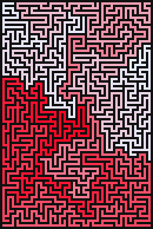

L E G E N D A R Y &nbsp; M A Z E S

a tiny javascript library for creating legendary mazes :sparkles:




### Demo or Die

In order to run the local demo app you need to start a local http server:

```sh
npx serve
```

Then simply call the following url with a browser of your choice: [http://localhost:5000/](http://localhost:5000/)


### Documentation

#### Getting Started

1. install the module in your project

```sh
npm i legendary-mazes
```

2. import what you need ..

```js
import {MazeGrid, RecursiveBacktracker, ...} from 'legendary-mazes';
```

#### API

Take a look into [./demo.js](./demo.js) for an example how to use this library.
