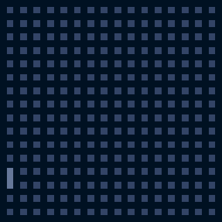

L E G E N D A R Y &nbsp; M A Z E S

[](https://badge.fury.io/js/legendary-mazes)

A tiny javascript library for creating legendary mazes :sparkles:




This library is using a _recursive backtracker_ [algorithm for maze generation](https://en.wikipedia.org/wiki/Maze_generation_algorithm)
&mdash; I implemented it relatively freely because it was so much fun :smiley:

Feel free to adapt, improve and extend the algorithm according to your needs - PR's are always welcome!

### Demo or Die

Just look at this codepen: https://codepen.io/spearwolf/full/yLePxBw

In order to run the local demo app you need to start a local http server:

```sh
npx serve
```

Then simply call the following url with a browser of your choice: [http://localhost:5000/](http://localhost:5000/)


### Documentation

#### Getting Started

1. Install the module in your project

```sh
npm i legendary-mazes
```

2. Import what you need

```js
import {
  MazeGrid,
  RecursiveBacktracker,
  DistanceGrid,
  MazeCanvasRenderer
} from 'legendary-mazes';
```

#### API

Take a look into [./demo.js](./demo.js) or [./codepen/](./codepen/) for examples how to use this library.
